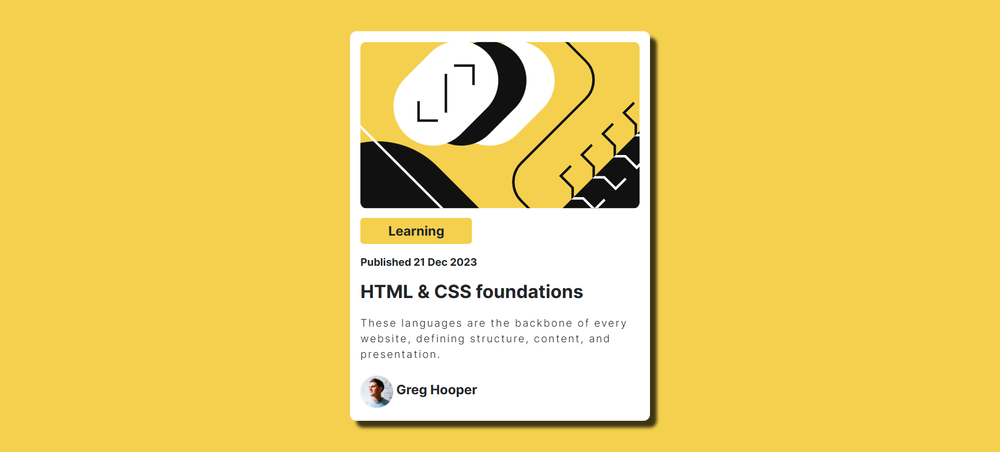

# Frontend Mentor - Blog preview card solution

This is a solution to the [Blog preview card challenge on Frontend Mentor](https://www.frontendmentor.io/challenges/blog-preview-card-ckPaj01IcS). Frontend Mentor challenges help you improve your coding skills by building realistic projects.

## Table of contents

- [Overview](#overview)
  - [The challenge](#the-challenge)
  - [Screenshot](#screenshot)
  - [Links](#links)
- [My process](#my-process)
  - [Built with](#built-with)
  - [What I learned](#what-i-learned)
- [Author](#author)
- [Acknowledgments](#acknowledgments)

## Overview

### Screenshot

### Links

- Solution URL: [https://github.com/Pro-Sultan/social-links-profile-main](https://github.com/Pro-Sultan/blog-preview-card)
- Live Site URL: [https://pro-sultan.github.io/social-links-profile-main/](https://pro-sultan.github.io/blog-preview-card/)

## My process

### Built with

- Semantic HTML5 markup
- CSS custom properties
- Bootstrap- CSS Library

### What I learned

Throughout the course of this project, I embarked on a journey to refine my skills in crafting responsive web designs. A pivotal aspect of this endeavor involved delving into the realm of Bootstrap, a powerful front-end framework renowned for its robust set of pre-designed components

## Author

- Frontend Mentor - [@Pro-Sultan](https://www.frontendmentor.io/profile/Pro-Sultan)
- Twitter - [@devsultan01](https://www.twitter.com/devsultan01)
